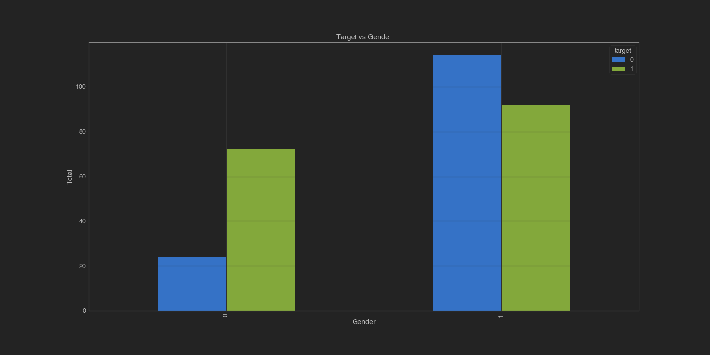

# DATA-SCIENCE-PROJECT-HEART-DISEASE
https://www.kaggle.com/ronitf/heart-disease-uci

Penyakit jantung masih menjadi momok bagi sebagian besar masyarakat Indonesia. Bukan tanpa alasan, penyakit yang satu ini merupakan penyebab kematian terbanyak ke-2 di Indonesia, menurut Kementerian Kesehatan. Dalam project ini, saya akan mencoba menganalisa terkait gejala atau pemicu terhadap kecenderungan seseorang menderita Penyakit Jantung. Dataset yang digunakan adalah dataset Exam saya di Modul 3, yang mana sumbernya berasal dari dataset heart-disease-uci yang mana link nya saya cantumkan diatas. Disini saya akan mencoba membuat Model Klasifikasi untuk mengetahui seseorang yang cenderung menderita Penyakit Jantung dan Tidak.

### Data Dictionary
- age
- sex
- chest pain type (4 values)
- resting blood pressure
- serum cholestoral in mg/dl
- fasting blood sugar > 120 mg/dl
- resting electrocardiographic results (values 0,1,2)
- maximum heart rate achieved
- exercise induced angina
- oldpeak = ST depression induced by exercise relative to rest
- the slope of the peak exercise ST segment
- number of major vessels (0-3) colored by flourosopy
- thal: 3 = normal; 6 = fixed defect; 7 = reversable defect

### Defining Problem
- Mengidentifikasi pengaruh usia dan gender terhadap potensi untuk kecenderungan terkena penyakit jantung
- Mengidentifikasi apa faktor-faktor penyakit jantung 
- Mengidentifikasi pasien yang cenderung mengidap penyakit jantung dan tidak dengan metode Supervised Machine Learning Classification

### Goals
- mendapatkan usia dan gender yang paling berpotensi terdampak kecenderungan penyakit jantung
- mendapatkan faktor-faktor lain yang mempengaruhi kecenderungan penyakit jantung
- mendapatkan model untuk mengklasifikasikan pasien yang memliki kecenderungan mengidap penyakit jantung dan tidak

### Target vs Age

### Target vs Gender

### Target vs Exercise

### Target vs FBS

### Target vs Chol

### Target vs CPT(Chest Pain Test)

### Target vs CA

### Target vs Depression

### Classification Score (%)
|  | Score(%) |
| --- | --- |
| Accuracy | 86.885246 |
| Recall | 90.62500 |
| Precision | 85.294118 |
| ROC AUC | 86.691810 |
| F1 Score | 87.878788 |

### Contact Me

| Contact Method |  |
| --- | --- |
| Professional Email | giovaldi8@gmail.com |
| Instagram | https://www.instagram.com/giovaldirch/ |
| LinkedIn | https://id.linkedin.com/in/giovaldi-r-00263411a |

